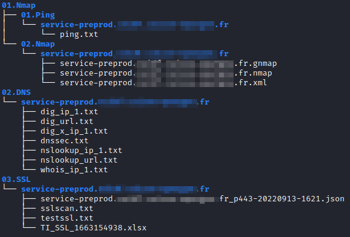

# Recon Scripts

Recon scripts for Red Team and Web blackbox auditing.


## Recon.py script

### Description
Have you ever done an audit with a lot of hosts to audit and were lazy to do all the blackbox tests by hand?

I made a nice little script that does a lot of blackbox tests (Ping, Nmap, DNS+DNSSec tests, sslscan + testssl) on a set of hosts you provide to the script.

The script provides almost no output, but stores the results in different folders/files:



NB.: If your testssl script is not located in `/opt/testssl.sh/testssl.sh`, modify the path in the recon.py script.

### Installation
The following commands must be executed to use the recon.sh script:
```
sudo apt-get update && sudo apt-get install jq nuclei -y
pip2 install hsecscan 
sudo mv recon.py /usr/bin/
sudo chmod +x /usr/bin/recon.py
sudo chown username:username /usr/bin/recon.py
wget -c "https://github.com/sensepost/gowitness/releases/download/2.4.2/gowitness-2.4.2-linux-amd64" && mv gowitness* gowitness && chmod +x gowitness && sudo mv gowitness /usr/bin
cd /opt
sudo git clone "https://github.com/jtesta/ssh-audit.git"
sudo chown -R username:username /opt/ssh-audit
wget -c "https://github.com/rverton/webanalyze/releases/download/v0.3.8/webanalyze_0.3.8_Linux_x86_64.tar.gz"
tar -xzvf webanalyze_0.3.8_Linux_x86_64.tar.gz
./webanalyze -update
rm -rf webanalyze_0.3.8_Linux_x86_64.tar.gz technologies.json
sudo mv webanalyze /usr/bin
cd /opt
sudo git clone https://github.com/ShutdownRepo/httpmethods
sudo chown -R username:username /opt/httpmethods
cd /opt/httpmethods
sudo python3 setup.py install
```

### Usage
```
usage: recon.py [-h] [-e] [-n] [-s] -d DIRECTORY (-f HOST_LIST_FILE | -l HOST_LIST [HOST_LIST ...])

options:
  -h, --help            show this help message and exit
  -e, --extended        Run extended tests (includes SSH, FTP and HTTP tests)
  -n, --nuclei          Use Nuclei scanner to scan assets
  -s, --screenshot      Use Gowitness to take screenshots of web assets

required arguments:
  -d DIRECTORY, --directory DIRECTORY
                        Directory that will store results

mutually exclusive arguments:
  -f HOST_LIST_FILE, --filename HOST_LIST_FILE
                        Filename containing domains to scan
  -l HOST_LIST [HOST_LIST ...], --list HOST_LIST [HOST_LIST ...]
                        List of domains to scan
```


## Asset_discovery.py script

### Description
Small script that allows to do DNS asset discovery, Nuclei scans, take screen of found web assets by combining the output of several tools.

The script needs a root_domain to bruteforce and an output_directory as arguments.
Ex: asset_discovery.py -d $(pwd) -l target.com -n -s

### Installation
The following commands must be executed to use the asset_discovery.sh script:
```
sudo apt-get update && sudo apt-get install subfinder jq nuclei gccgo-go -y
pip3 install aiodnsbrute
pip3 install cidrize
sudo mv asset_discovery.py /usr/bin/
sudo chmod +x /usr/bin/asset_discovery.py
sudo chown username:username /usr/bin/asset_discovery.py
sudo su
go env -w GO111MODULE=off
cd /opt/
git clone https://github.com/hvs-consulting/SANextract
cd SANextract
go build
chown -R username:username /opt/SANextract
wget -c "https://github.com/sensepost/gowitness/releases/download/2.4.2/gowitness-2.4.2-linux-amd64" && mv gowitness* gowitness && chmod +x gowitness && sudo mv gowitness /usr/bin
wget -c "https://github.com/rverton/webanalyze/releases/download/v0.3.8/webanalyze_0.3.8_Linux_x86_64.tar.gz"
tar -xzvf webanalyze_0.3.8_Linux_x86_64.tar.gz
./webanalyze -update
rm -rf webanalyze_0.3.8_Linux_x86_64.tar.gz technologies.json
sudo mv webanalyze /usr/bin
```
Please note that **Go** must be installed on your machine.

### Usage
```
usage: asset_discovery.py [-h] [-n] [-s] [-w] -d DIRECTORY (-f HOST_LIST_FILE | -l HOST_LIST [HOST_LIST ...])

options:
  -h, --help            show this help message and exit
  -n, --nuclei          Use Nuclei scanner to scan found assets
  -s, --screenshot      Use Gowitness to take screenshots of found web assets
  -w, --webanalyzer      Use Webanalyzer to list used web technologies

required arguments:
  -d DIRECTORY, --directory DIRECTORY
                        Directory that will store results

mutually exclusive arguments:
  -f HOST_LIST_FILE, --filename HOST_LIST_FILE
                        Filename containing root domains to scan
  -l HOST_LIST [HOST_LIST ...], --list HOST_LIST [HOST_LIST ...]
                        List of root domains to scan
```
